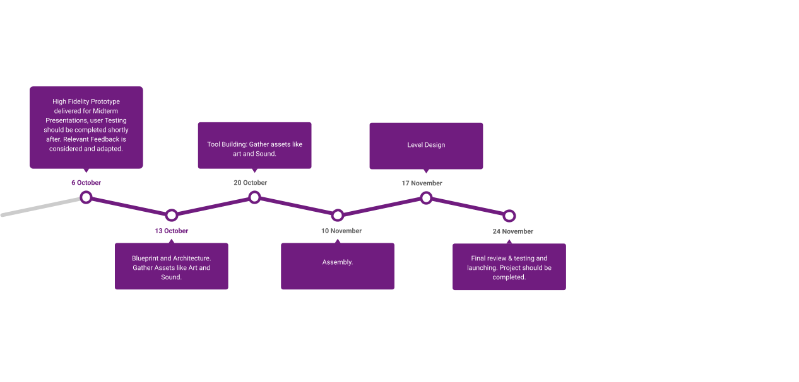

# Midterm Presentation

## Project: Green Thumb
This will be a VR game. I will mainly be designing for PC VR, but I hope to be able to port the game over to mobileVR.
## Backstory/inspiration
I just knew I wanted to create something that included somehow included gardening. 
## Timeline

## Functional and Non-Functional Requirements
System = Game

Player = User Requirements

? = Secondary Requirement and not needed for primary implementation

Functional Requirements:

Game Basics:

	System should allow the user to be a player.
	System should allow the user to be the only person in the game at one time.
	System should allow the player to save the game at its current state (?)
	System should allow the player to leave the game.
	System should allow the player to change game settings.
	System should detect what platform game is being played on and adjust

Gardening

	Player should be able to plant seeds and provide water, fertilizer, and love.
System should react to player inputs and grow plants.
System should recognize when player does not water plants for a given period of time and have plants die.

Collision Detection: 

	System shall detect a collision between interactable object and interactable object.
	System shall detect a collision between an interactable object and static object
	System shall detect a collision between interactable object and ground.
	System shall detect a collision between player controllers and interactable objects
	System shall detect a collision between player controller and static object.
	System shall set resistance for each ground object. 
	System shall set resistance between interactable objects. 

Non-functional: 

- Frame Rate: Min; 45 Ideally 90+ to avoid motion sickness.
- Usability: Useable on multiple platforms PC VR and Mobile VR.
- Response time: 0.5 Seconds.
- Required resources: Stated in Physical Requirements.
- Platform: PC and Mobile.
- Maintainability: Maintainable up until Semester completion.

## Storyboard
Refer to Video file in Includes folder.

## Estimate of how long it will take
Realistically, this game would probably take a couple years, but I am aiming for a 2nd Prototype game for the Final Presentation that should take about 6 weeks. 
## Progress